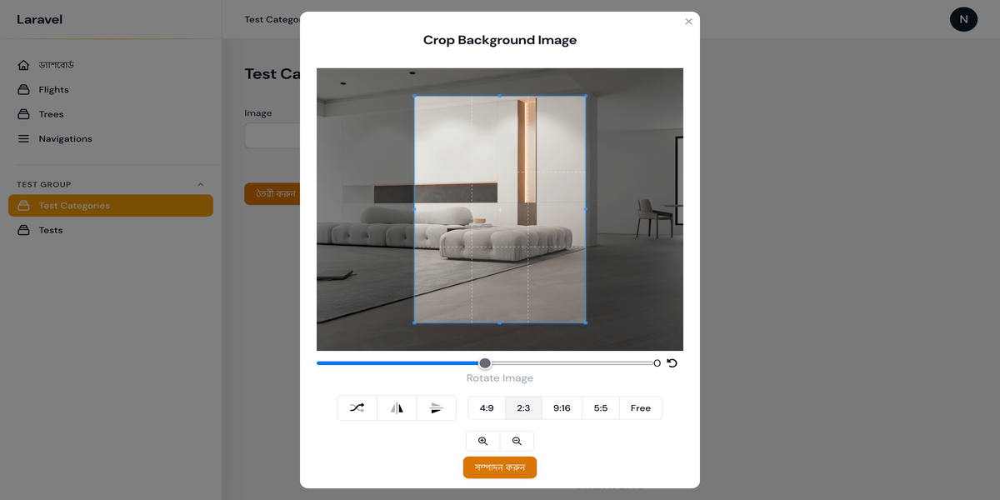

# Filament Cropper Plugin

[](https://packagist.org/packages/nuhel/filament-cropper)
[](https://packagist.org/packages/nuhel/filament-cropper)


## Installation

You can install the package via composer:

```bash
composer require nuhel/filament-cropper
```

This field has most of the same functionality of the [Filament File Upload](https://filamentphp.com/docs/2.x/forms/fields#file-upload) field.


```php
  Cropper::make('image')
      ->getUploadedFileNameForStorageUsing(function (TemporaryUploadedFile $file): string {
          return (string)str("image_path/" . $file->hashName());
      })->enableDownload()
      ->enableOpen()
      ->enableImageRotation()
      ->enableImageFlipping()
      ->imageCropAspectRatio('16:9'),
```
Using `imageCropAspectRatio` we can set aspect ratio of the cropper.

```php
Cropper::make('avatar')
        ->avatar()
        ->enableOpen()
        ->enableDownload()
        ->modalSize('xl'),
```
We can make cropper circular using `avatar` method.


Modal size can be customized if it is needed,
using `modalSize` method.
```php
Cropper::make('avatar')
        ->avatar()
        ->enableOpen()
        ->enableDownload()
        ->modalSize('xl')
        ->modalHeading("Crop Background Image")
```


`List of available options`

```php
Cropper::make('image')
            ->modalSize('xl')
            ->modalHeading("Crop Background Image")
            ->enableImageRotation()
            ->rotationalStep(5)
            ->enableImageFlipping()
            ->enabledAspectRatios([
                '2:3', '9:16', '5:5'
            ])
            ->zoomable(true)
            ->enableZoomButtons()
            ->enableAspectRatioFreeMode()
            ->imageCropAspectRatio('4:9')
```


## Thumbnail Image
Now You generate Thumbnail Image using `generateThumbnailImage()` method.

```php  
Cropper::make('avatar')
		->enableOpen()
		->enableDownload()
		->generateThumbnailImage(),  
```

By default, it's use **thumbnailImages** Folder to store Generated Thumbnail Images.  
But It can be overridden using `thumbnailImageDirectory` method.

**Note :** [Image Intervention](https://github.com/Intervention/image) Package is required to generate Thumbnail Images by default.

However it's possible to customize the way of generating thumbnail image using method `generateThumbnailImageUsing`

```php  
Cropper::make('avatar')
		->enableOpen()
		->enableDownload()
		->generateThumbnailImage()
		->generateThumbnailImageUsing(function(TemporaryUploadedFile $file, string $filename, string $diskName, ?string $directory, string $visibility){
			...Your Code Here
		})->removeThumbnailImageUsing(function(TemporaryUploadedFile $file, string $filePath, string $diskName, ?string $directory, string $visibility){  
			...Your Code Here
		})
```


## License

The MIT License (MIT). Please see [License File](LICENSE.md) for more information.
